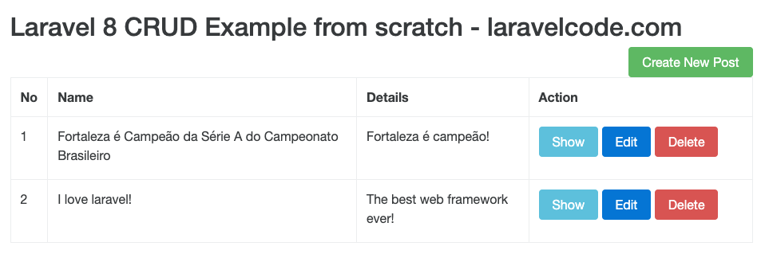

# Laravel 8 CRUD Tutorial

This project is a full crud tutorial using [Resource Controllers](https://laravel.com/docs/8.x/controllers#resource-controllers). 

### References
* [Laravel 8 - CRUD application tutorial with Example](https://www.laravelcode.com/post/laravel-8-crud-application-tutorial-with-example)
* [Resource Controllers](https://laravel.com/docs/8.x/controllers#resource-controllers)